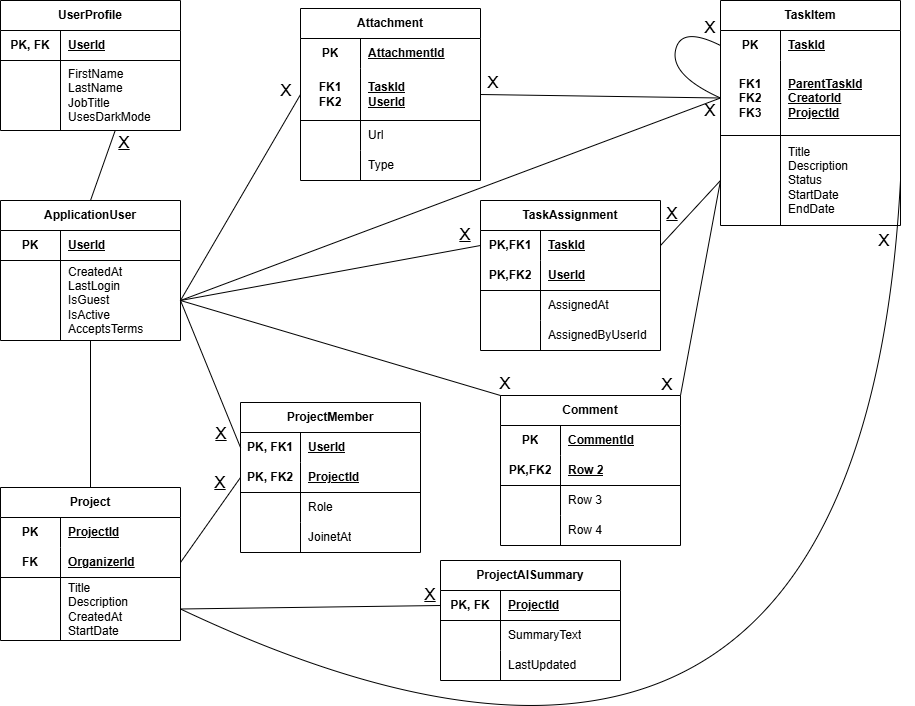
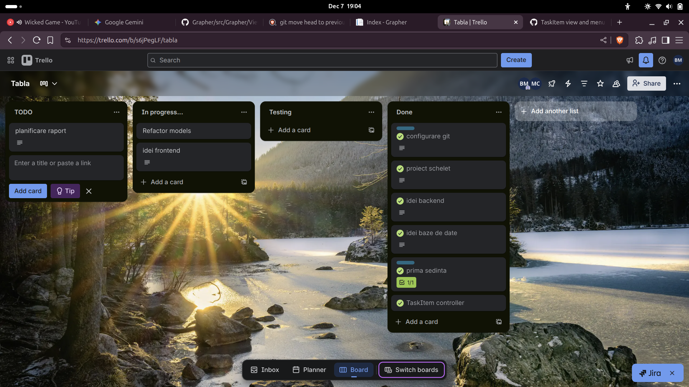
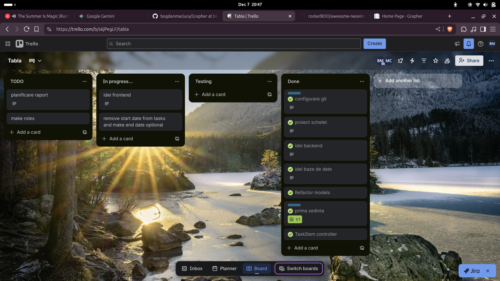
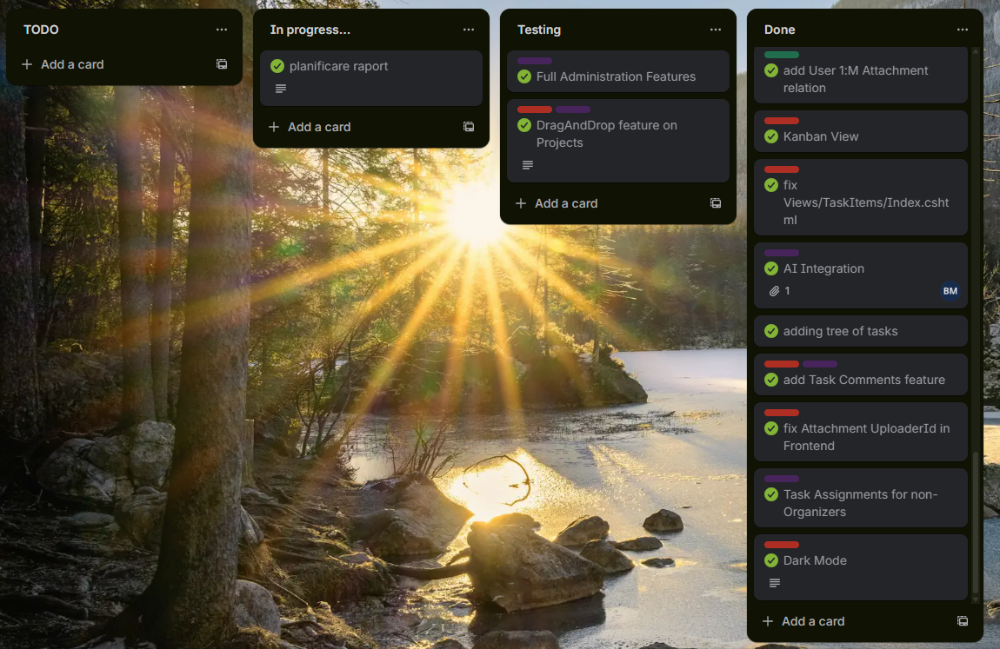

# Grapher - Task Management Tool
Grapher este o aplicație clasică de gestionare a sarcinilor în cadrul unui proiect la nivel de echipă ce introduce ideea de reprezentare a unui proiect ca o *pădure de arbori* de elemente, implementând elementul logic și vizual ce permite sarcinilor să depindă unele de altele în anumite contexte.

## Planificarea - Împărțirea Sarcinilor
Împărțirea a fost liniară, respectând ideologia de a prioritiza proiectarea unei baze de date solide, pe care să se poată construi convenient cod de **backend**, ca mai apoi să putem termina cu **frontend**-ul.

Având în vedere că am fost o echipă de doi membri cu preferințe relativ diferite, eu *(Matei)* am fost cel responsabil cu proiectarea bazei de date și m-am ocupat predominant de partea de back-end, iar Bogdan a venit în completarea mea și s-a ocupat de majoritatea codului ce implica servicii externe *(integrare AI, autentificare prin e-mail)*.

## Metodologia de Lucru - Sprinturile
Am ales să folosim metodologia Agile, trecând prin tot procesul de **Design**$\rightarrow$
**Develop**$\rightarrow$**Test**$\rightarrow$**Review** în cadrul fiecărui sprint.

Primii pași luați in direcția proiectului au constat în definirea spațiului de lucru general și schițarea pașilor proiectului, fiind luați în cadrul unei întâlniri după care am reușit să cădem de acord la implementarea unui schelet general, a unui scop și a ideii originale *(implicit și modalitatea de implementare a acesteia)*.

Tot în cadrul acestei ședințe, am definit în mare diagrama pe care urma să o implementăm - pe parcursul proiectului, au fost necesare modificări minime, fie că au ținut de *practică bună* a scrierii de cod, *securitate* sau *logică*.

#### 1. Modelul `ApplicationUser` (Extensie Identity)

Acesta reprezintă actorul principal în sistem și extinde funcționalitatea standard oferită de framework-ul de autentificare.

* **Rol:** Gestionarea identității, autentificării și autorizării.
* **Atribute Cheie:** Pe lângă câmpurile standard (`Id`, `Email`, `PasswordHash`), modelul include atribute specifice logicii de business, precum `FirstName` și `LastName` pentru afișarea prietenoasă în interfață.
* **Relații:**
* **1:M cu TaskItem:** Un utilizator poate fi creatorul sau responsabilul (Assignee) pentru mai multe sarcini.
* **1:M cu Attachment:** Așa cum am menționat în secțiunea de impedimente, fiecare fișier încărcat este legat direct de utilizatorul care a efectuat acțiunea, prin `UploaderId`.

#### 2. Modelul `TaskItem` (Nucleul Aplicației)

Este cea mai complexă entitate, servind drept nod central în structura de "pădure" a proiectului.

* **Rol:** Stocarea datelor despre sarcini și gestionarea poziției lor în ierarhie.
* **Atribute Cheie:**
* `Title` și `Description`: Definesc conținutul sarcinii.
* `State`: Un *Enum* (sau string constrâns) esențial pentru funcționalitatea Kanban (valori: *Todo, InProgress, Done*).
* `Deadline`: Permite ordonarea temporală și notificările.

* **Logica Recursive (Self-Referencing):**
* Câmpul `ParentId` (Foreign Key nullable) este elementul tehnic care transformă o listă simplă într-un arbore. Dacă `ParentId` este `null`, sarcina este o rădăcină (Root Task); altfel, este o sub-sarcină.

#### 3. Modelul `Attachment` (Resurse)

Modelul a fost introdus pentru a decupla stocarea fișierelor de tabela principală de sarcini, optimizând performanța bazei de date.

* **Rol:** Gestionarea metadatelor fișierelor încărcate (imagini, documente).
* **Atribute Cheie:**
* `FilePath`: Calea relativă către fișierul stocat pe disc/server.
* `FileName`: Numele original al fișierului pentru afișare.
* `Extension`: Utilizat pentru a randa pictograme specifice tipului de fișier în UI.

* **Relații:**
* Funcționează ca tabelă de legătură cu informații suplimentare, având Foreign Keys către `TaskItem` (sarcina căreia îi aparține) și `ApplicationUser` (cine l-a încărcat).

---

Având ca prioritate integritatea datelor, am structurat modelele pentru a susține relații complexe între entități. Un punct central al dezvoltării a fost definirea clară a **rolurilor și permisiunilor**:

* **Gestiunea Membrilor și Rolurilor:** Am implementat o logică strictă în `TaskItemsController` și `ProjectsController`. Doar utilizatorii cu rol de *Organizer* au drepturi depline (CRUD) asupra tuturor sarcinilor, în timp ce membrii standard *(Non-Organizers)* sunt limitați la gestionarea propriilor sarcini sau crearea unora noi, fără a putea altera munca altora.

* **Validarea Datelor:** Pentru a asigura consistența, am introdus constrângeri de tip `required` direct pe atributele modelelor, prevenind inserarea datelor incomplete în baza de date.

Partea de servicii externe, gestionată predominant de Bogdan, a adus un plus de valoare aplicației prin:

* **Integrare AI:** Am adăugat un modul de Inteligență Artificială pentru a asista utilizatorii în definirea sau optimizarea sarcinilor, utilizând *apeluri API* modelului Google **Gemini 3**.
* **Sistem de Invitații:** Implementarea funcționalității de "Invite Button" a permis extinderea ușoară a echipelor, simplificând procesul de onboarding pentru noi membri.

### 3. Frontend & User Experience

Odată stabilizat backend-ul, ne-am concentrat pe experiența vizuală și interactivitate, migrând de la o simplă listă de sarcini la instrumente vizuale avansate:

* **Vizualizare Kanban:** Am dezvoltat un *Kanban View* complet funcțional, care suportă **Drag & Drop**. Aceasta permite utilizatorilor să mute sarcinile între stări *(TODO, In Progress, Done)* interactiv, direct din meniu, fără a fi nevoie să intre în detaliile fiecărui task.
* **Reprezentarea Arborescentă:** Respectând conceptul de "pădure de arbori" menționat în introducere, am implementat vizualizarea ierarhică a sarcinilor (*Tree of Tasks*), esențială pentru proiectele cu dependențe complexe.
* **Dark Mode:** Pentru a alinia aplicația la standardele moderne de UI, am implementat o temă întunecată (Dark Mode) disponibilă pentru toți utilizatorii înregistrați.
* **Paginație și Optimizare:** Am introdus paginarea în `Views/TaskItems/Index` pentru a gestiona eficient afișarea unui număr mare de sarcini, îmbunătățind timpul de încărcare.

## Impedimente - Soluții

Pe parcursul sprinturilor, am întâmpinat diverse obstacole tehnice pe care le-am documentat și soluționat:

1. **Organizarea Setup-ului inițial:**
* *Impediment:* Am întâmpinat în prim plan probleme sincronizarea fișierelor încărcate la nivel de repository, având deseori situații de conflicte.
* *Soluție:* În cazul situaților întâlnite, una dintre cele mai utilizate *tool-uri* a fost **GitKraken**, rezolvând astfel cu succes chiar și *merge conflicts* la nivelul fișierelor *mari* cu **modulul integrat AI**.

2. **Complexitatea Relațiilor (Uploader ID):**
* *Impediment:* Am întâmpinat probleme la asocierea corectă a fișierelor atașate cu utilizatorul care le-a încărcat (*Attachment UploaderId*) în interfața grafică.
* *Soluție:* Am depanat și rectificat logica din frontend pentru a trimite corect ID-ul utilizatorului curent către backend la momentul upload-ului.

3. **Gestionarea Permisiunilor:**
* *Impediment:* Inițial, distincția dintre *Organizers* și utilizatorii simpli era ambiguă, permițând modificări neautorizate.
* *Soluție:* Am rescris logica din `TaskItemController`, introducând verificări explicite de rol înainte de fiecare acțiune de *Edit* sau *Delete*. De asemenea, am eliminat butoanele de acțiune din interfață pentru utilizatorii fără drepturi, pentru a nu crea confuzie.
