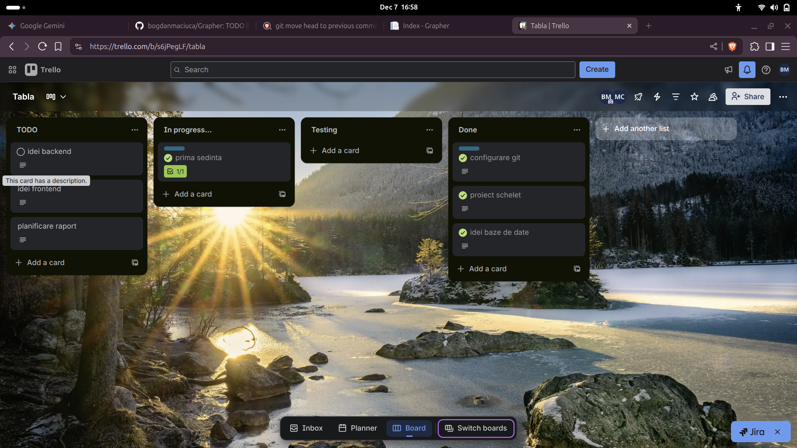
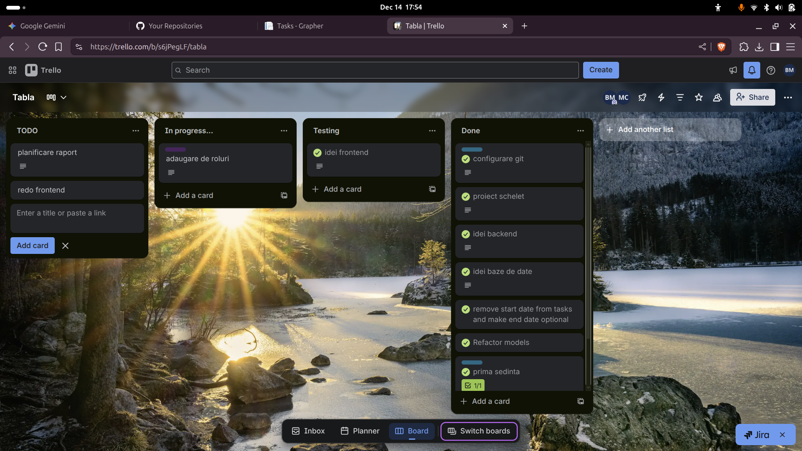
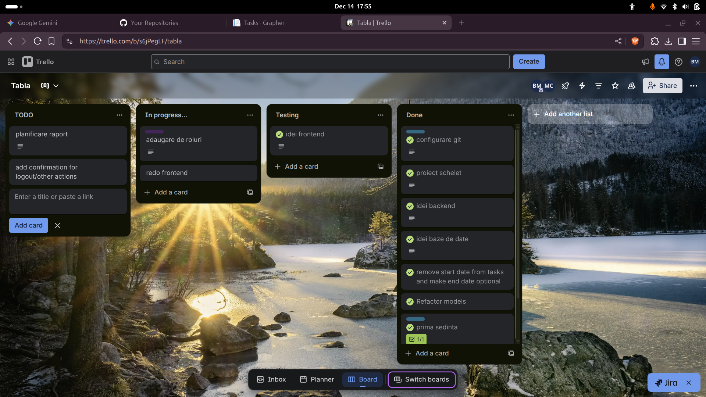
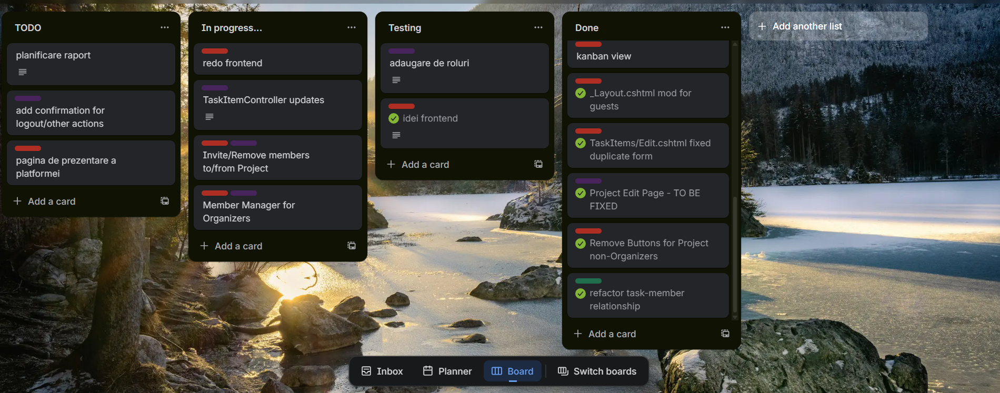
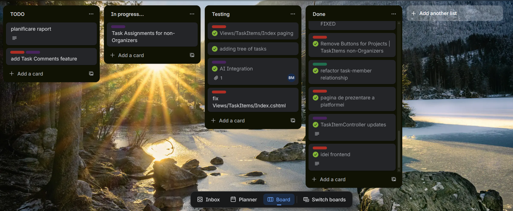

# Grapher - Task Management Tool
Grapher este o aplicație clasică de gestionare a sarcinilor în cadrul unui proiect la nivel de echipă ce introduce ideea de reprezentare a unui proiect ca o *pădure de arbori* de elemente, implementând elementul logic și vizual ce permite sarcinilor să depindă unele de altele în anumite contexte.

## Planificarea - Împărțirea Sarcinilor
Împărțirea a fost liniară, respectând ideologia de a prioritiza proiectarea unei baze de date solide, pe care să se poată construi convenient cod de **backend**, ca mai apoi să putem termina cu **frontend**-ul.

Având în vedere că am fost o echipă de doi membri cu preferințe relativ diferite, eu *(Matei)* am fost cel responsabil cu proiectarea bazei de date și m-am ocupat predominant de partea de back-end, iar Bogdan a venit în completarea mea și s-a ocupat de majoritatea codului ce implica servicii externe *(integrare AI, autentificare prin e-mail)*.

## Metodologia de Lucru - Sprinturile
Am ales să folosim metodologia Agile, trecând prin tot procesul de **Design**$\rightarrow$
**Develop**$\rightarrow$**Test**$\rightarrow$**Review** în cadrul fiecărui sprint.

Primii pași luați in direcția proiectului au constat în definirea spațiului de lucru general și schițarea pașilor proiectului, fiind luați în cadrul unei întâlniri în care am discutat până la cei mai minuțioși pași.

## Impedimente - Soluții

